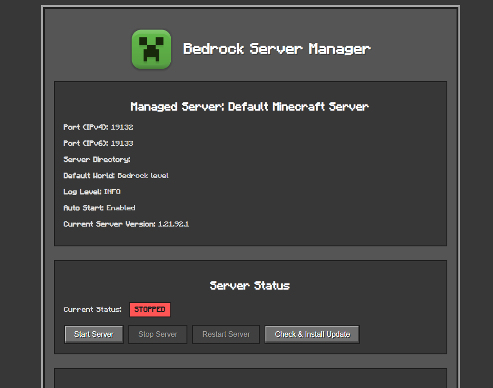

# Minecraft Bedrock Server Manager

This application provides a web-based interface to manage a single Minecraft Bedrock Dedicated Server. You can start, stop, and restart your server, manage updates, tweak server properties (`server.properties`), manage worlds, and configure automatic updates. The interface is designed to be mobile-friendly.


*(Note: The screenshot shows the general UI. Some minor details might differ slightly with the current version.)*

**Just so you know: This is a fan-made tool! It's not officially linked to or endorsed by Mojang, Minecraft, or Microsoft.**

---

## What's Inside?

1.  [Prerequisites](#1-prerequisites)
2.  [Node.js Installation](#2-nodejs-installation)
    *   [Windows](#nodejs-for-windows)
    *   [Linux](#nodejs-for-linux)
3.  [Application Setup](#3-application-setup)
    *   [Configuration (`config.json`)](#configuration-configjson)
    *   [Command-Line Overrides](#command-line-overrides)
4.  [Starting the Application](#4-starting-the-application)
5.  [Basic Usage](#5-basic-usage)
    *   [Server Information](#server-information)
    *   [Server Controls](#server-controls)
    *   [Auto-Update Settings](#auto-update-settings)
    *   [World Management](#world-management)
    *   [Server Properties](#server-properties)
    *   [Pack Management](#pack-management)
6.  [Running Multiple Server Managers](#6-running-multiple-server-managers)

---

## 1. Prerequisites

*   **Node.js and npm:** The application runs on Node.js. `npm` (Node Package Manager) is included with Node.js.
*   **Minecraft Bedrock Dedicated Server Software:** You should have the server software from Mojang. The manager can download it for you if it's not present in the configured server directory during the first update check.
*   **System Utilities:**
    *   **Linux:** `unzip` is required for extracting server files. Install via `sudo apt-get install unzip` (Debian/Ubuntu) or `sudo yum install unzip` (CentOS/RHEL).
    *   **Windows:** PowerShell (typically version 5.1+) is required for server extraction. This is usually available by default on modern Windows systems.

---

## 2. Node.js Installation

### Node.js for Windows

1.  **Download:** Go to [https://nodejs.org/](https://nodejs.org/) and download the Windows Installer (.msi) for the latest LTS version.
2.  **Install:** Run the installer, accepting default options.
3.  **Verify:** Open Command Prompt or PowerShell and type `node -v` and `npm -v`. You should see their versions.

### Node.js for Linux

Using Node Version Manager (`nvm`) is recommended:

1.  **Install `nvm`:**
    ```bash
    curl -o- https://raw.githubusercontent.com/nvm-sh/nvm/v0.39.7/install.sh | bash
    ```
    *(Check the `nvm` GitHub page for the latest version number).* Close and reopen your terminal, or run `source ~/.bashrc` (or `~/.zshrc`).
2.  **Install Node.js LTS:**
    ```bash
    nvm install --lts
    nvm use --lts
    ```
3.  **Verify:** Type `node -v` and `npm -v`.

---

## 3. Application Setup

1.  **Get the Application Files:**
    Clone this repository or download and extract the ZIP file.
    ```bash
    git clone <repository-url>
    cd minecraft-bedrock-server-manager
    ```
2.  **Install Dependencies:**
    Navigate to the application directory in your terminal and run:
    ```bash
    npm install
    ```
3.  **Configuration (`config.json`):**
    The primary way to configure the server manager is through the `config.json` file located in the application's root directory. If this file is missing, a default one will be created when you first run the application.

    Here's an overview of the `config.json` structure and fields:

    ```json
    {
      "serverName": "Default Minecraft Server",
      "serverPortIPv4": 19132,
      "serverPortIPv6": 19133,
      "serverDirectory": "./server_data/default_server",
      "tempDirectory": "./server_data/temp/default_server",
      "backupDirectory": "./server_data/backup/default_server",
      "worldName": "Bedrock level",
      "autoStart": false,
      "autoUpdateEnabled": true,
      "autoUpdateIntervalMinutes": 60,
      "logLevel": "INFO"
    }
    ```

    *   `serverName`: A friendly name for your server (displayed in the UI).
    *   `serverPortIPv4`: The IPv4 port for the Minecraft server (must match `server-port` in `server.properties`).
    *   `serverPortIPv6`: The IPv6 port for the Minecraft server (must match `server-portv6` in `server.properties`).
    *   `serverDirectory`: Path to your Minecraft server files.
        *   If relative (e.g., starts with `./` or `../`), it's resolved relative to the application's root directory.
        *   If absolute, it's used as is.
    *   `tempDirectory`: Path for temporary downloads (e.g., server updates). Resolved like `serverDirectory`.
    *   `backupDirectory`: Path to store server backups. Resolved like `serverDirectory`.
    *   `worldName`: The default world name to set in `server.properties` if not already set.
    *   `autoStart`: (boolean) If `true`, the manager will attempt to start the Minecraft server when the manager itself starts.
    *   `autoUpdateEnabled`: (boolean) If `true`, enables automatic checking and installation of server updates.
    *   `autoUpdateIntervalMinutes`: (number) How often (in minutes) to check for updates if auto-update is enabled.
    *   `logLevel`: (string) Controls log verbosity. Options: "DEBUG", "INFO", "WARNING", "ERROR", "FATAL". Defaults to "INFO".

4.  **Command-Line Overrides:**
    You can override settings from `config.json` at runtime using command-line arguments when starting the application (e.g., `node app.js --serverPortIPv4 19134 --autoStart true`).

    Supported overrides:
    *   `--serverName <name>`
    *   `--serverPortIPv4 <port>`
    *   `--serverPortIPv6 <port>`
    *   `--serverDirectory <path>`
    *   `--tempDirectory <path>`
    *   `--backupDirectory <path>`
    *   `--worldName <name>`
    *   `--autoStart` or `--autoStart true` / `--autoStart false` (or `--no-autoStart`)
    *   `--autoUpdateEnabled` or `--autoUpdateEnabled true` / `--autoUpdateEnabled false` (or `--no-autoUpdateEnabled`)
    *   `--logLevel <level>` (e.g., DEBUG, INFO)

5.  **First-Time Server Setup:**
    If the directory specified in `serverDirectory` is empty or doesn't contain server files, use the "Check & Install Update" button in the web interface. This will download and set up the latest official Bedrock server software.

---

## 4. Starting the Application

1.  Navigate to the application directory in your terminal.
2.  Run the application:
    ```bash
    node app.js [cli-overrides]
    ```
    For example: `node app.js --serverPortIPv4 19134`
3.  Open your web browser and go to `http://localhost:3000` (or the port specified if `PORT` in `app.js` was changed).

---

## 5. Basic Usage

The web interface provides several sections for managing your server:

### Server Information
At the top of the page, you'll see details about the configured Minecraft server, such as its name, directory, and ports, as read from `config.json` and CLI overrides.

### Server Controls
*   **Server Status:** Indicates if the Minecraft server is `RUNNING` or `STOPPED`.
*   **Start Server:** Starts the Minecraft server.
*   **Stop Server:** Stops the Minecraft server.
*   **Restart Server:** Restarts the Minecraft server.
*   **Check & Install Update:**
    1.  Checks the official Minecraft website for the latest server version.
    2.  If a new version is found:
        *   Stops the current server (if running).
        *   Backs up existing server data (worlds, `server.properties`, `permissions.json`, `whitelist.json`).
        *   Downloads and extracts the new server files.
        *   Restores the backed-up data into the new server directory.
        *   Starts the updated server.

### Auto-Update Settings
*   **Enable Automatic Updates:** Check this box to have the manager automatically check for and install updates.
*   **Update Check Interval (minutes):** Set how often (in minutes) to check for new server versions.
*   **Save Auto-Update Settings:** Click to apply your auto-update preferences.

### World Management
*   Displays a list of world folders found in your server's `worlds` directory.
*   The currently active world (as per `server.properties`) is highlighted.
*   **Activate Button:** Click this next to a world's name. This updates the `level-name` field in the "Server Properties" section below. You **must** click "Save Properties" in that section and then restart the server for the world change to take effect.

### Server Properties
*   Allows you to view and edit your `server.properties` file directly from the UI.
*   Modify values as needed.
*   **Save Properties:** Click to save your changes to `server.properties`. **A server restart is usually required for most property changes to apply.**

### Pack Management
This section allows you to upload and manage behavior and resource packs for your server.
*   **Pack File (.mcpack):** Select the `.mcpack` file you want to upload.
*   **Pack Type:** Choose the type of pack you are uploading:
    *   `Behavior Pack`: For custom behaviors, entities, etc. Installed in `behavior_packs`.
    *   `Resource Pack`: For custom textures, sounds, UI, etc. Installed in `resource_packs`.
    *   `Development Behavior Pack`: For behavior packs used during development. Installed in `development_behavior_packs`.
    *   `Development Resource Pack`: For resource packs used during development. Installed in `development_resource_packs`.
*   **Target World:** Select the world to which this pack should be applied. The manager will update the corresponding `world_behavior_packs.json` or `world_resource_packs.json` file for that world.
*   **Upload Pack:** Click to upload the selected pack.
    *   The pack will be extracted to the appropriate directory within your `serverDirectory`.
    *   The relevant world configuration JSON file will be updated to include the pack.
    *   **Note:** A server restart might be required for the pack to become active or for changes to take full effect, especially for behavior packs or if a world is already loaded.

---

## 6. Running Multiple Server Managers

Each instance of this application manages a *single* Minecraft Bedrock server. If you want to manage multiple Minecraft servers, you need to run multiple independent instances of this server manager. Here are two common ways:

1.  **Separate Directories:**
    *   Copy the entire application into separate folders (e.g., `mc_manager_server1`, `mc_manager_server2`).
    *   Each folder will have its own `config.json`. Edit each `config.json` to point to unique `serverDirectory`, `tempDirectory`, `backupDirectory`, and importantly, ensure the Minecraft server ports (`serverPortIPv4`, `serverPortIPv6`) are unique for each server to avoid conflicts.
    *   You'll also need to run `node app.js` from within each directory, ensuring each manager instance listens on a unique web interface port (by modifying `PORT` in `app.js` for each copy, or by using a reverse proxy).

2.  **CLI Overrides from a Single Application Directory:**
    *   You can run multiple `node app.js` processes from the same application code.
    *   For each process, use command-line arguments to specify unique settings, especially:
        *   `--serverDirectory <unique_path_for_server1_data>`
        *   `--tempDirectory <unique_path_for_server1_temp>`
        *   `--backupDirectory <unique_path_for_server1_backup>`
        *   `--serverPortIPv4 <unique_port_for_server1_ipv4>`
        *   `--serverPortIPv6 <unique_port_for_server1_ipv6>`
        *   You'll also need to ensure each manager instance's web UI runs on a different port. This currently requires modifying the `PORT` constant in `app.js` for each process or using a reverse proxy setup.
    *   Example:
        ```bash
        # Terminal 1 (for server 1 on UI port 3000)
        # (Modify app.js to use PORT 3000 or ensure it's default)
        node app.js --serverName "Server One" --serverDirectory ./server1_data --serverPortIPv4 19132 --serverPortIPv6 19133

        # Terminal 2 (for server 2 on UI port 3001)
        # (Modify app.js to use PORT 3001 for this run, or use PM2 with port args)
        node app.js --serverName "Server Two" --serverDirectory ./server2_data --serverPortIPv4 19134 --serverPortIPv6 19135
        ```
    *   Managing the different web UI ports for each manager instance is key. Using a process manager like PM2 can help manage multiple Node.js processes with different environment variables or arguments.

**Key for multiple servers:** Each Minecraft Bedrock server *must* have its own unique data directory and operate on unique game ports.

---

Have fun managing your Minecraft Bedrock Server!
